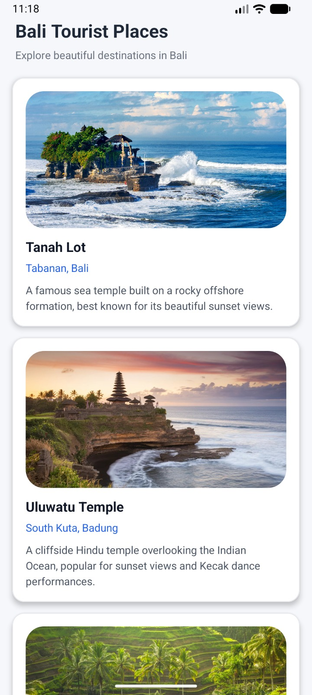

# Bali Tourism App

<div align="center">


**Aplikasi Android untuk menampilkan daftar tempat wisata populer di Bali menggunakan RecyclerView.**

</div>

---

## Deskripsi

**Bali Tourism App** adalah aplikasi Android native yang dikembangkan sebagai bagian dari tugas pengganti Ujian Tengah Semester pada mata kuliah Pemrograman Mobile A.. Aplikasi ini menampilkan informasi mengenai destinasi wisata terkenal di Pulau Bali. Aplikasi ini dibangun sebagai bagian dari tugas **Pemrograman Mobile** untuk mendemonstrasikan penggunaan `RecyclerView` dengan custom adapter dan `MaterialCardView` dalam pengembangan aplikasi Android.

Setiap item destinasi wisata menampilkan:
- **Gambar** lokasi wisata
- **Nama** tempat wisata
- **Lokasi** (kabupaten/kota)
- **Deskripsi** singkat mengenai tempat tersebut

## Fitur

- Daftar **9 destinasi wisata** populer di Bali
- Tampilan **Material Card** dengan rounded corners & elevation
- **Rounded images** menggunakan `ShapeableImageView`
- UI yang bersih dan modern dengan tema **Material Components**
- **RecyclerView** dengan `LinearLayoutManager` untuk scrolling yang efisien
- Desain minimalis dengan palet warna yang konsisten

## Destinasi Wisata

| No | Tempat Wisata | Lokasi |
|----|---------------------------|----------------------|
| 1  | Tanah Lot                 | Tabanan, Bali        |
| 2  | Uluwatu Temple            | South Kuta, Badung   |
| 3  | Tegallalang Rice Terrace  | Ubud, Gianyar        |
| 4  | Mount Batur               | Kintamani, Bangli    |
| 5  | Besakih Temple            | Karangasem, Bali     |
| 6  | Nusa Penida               | Klungkung, Bali      |
| 7  | Sanur Beach               | Denpasar, Bali       |
| 8  | Garuda Wisnu Kencana      | Ungasan, Badung      |
| 9  | Sekumpul Waterfall        | Buleleng, Bali       |

## Tech Stack

| Teknologi | Versi | Keterangan |
|-----------|-------|------------|
| **Kotlin** | 2.0.21 | Bahasa pemrograman utama |
| **Android Gradle Plugin** | 8.13.2 | Build system |
| **RecyclerView** | 1.4.0 | Menampilkan daftar item secara efisien |
| **Material Components** | 1.11.0 | UI components (`MaterialCardView`, `ShapeableImageView`) |
| **AppCompat** | 1.7.1 | Backward compatibility |
| **AndroidX Core KTX** | 1.18.0 | Kotlin extensions untuk Android |

## Struktur Project

```
BaliTourismApp/
├── app/
│   └── src/
│       └── main/
│           ├── AndroidManifest.xml
│           ├── java/com/example/balitourismapp/
│           │   ├── MainActivity.kt          # Activity utama dengan RecyclerView
│           │   ├── TouristAdapter.kt        # Custom RecyclerView Adapter
│           │   └── TouristPlace.kt          # Data class model
│           └── res/
│               ├── drawable/                # Gambar destinasi wisata
│               ├── layout/
│               │   ├── activity_main.xml    # Layout utama
│               │   └── item_layout.xml      # Layout item RecyclerView
│               └── values/
│                   ├── colors.xml           # Definisi warna
│                   ├── strings.xml          # String resources
│                   └── themes.xml           # Tema aplikasi
├── build.gradle.kts                         # Root build configuration
├── settings.gradle.kts                      # Project settings
└── gradle/
    └── libs.versions.toml                   # Version catalog
```

## Arsitektur Kode

### `TouristPlace.kt` — Data Model
```kotlin
data class TouristPlace(
    val name: String,
    val location: String,
    val description: String,
    val imageResId: Int
)
```
Data class sederhana yang merepresentasikan satu destinasi wisata.

### `TouristAdapter.kt` — RecyclerView Adapter
Custom adapter yang mengextend `RecyclerView.Adapter` dengan `ViewHolder` pattern untuk menampilkan setiap item destinasi wisata ke dalam `MaterialCardView`.

### `MainActivity.kt` — Activity Utama
Activity yang menginisialisasi `RecyclerView` dengan `LinearLayoutManager` dan mengisi data 9 destinasi wisata ke adapter.

## Cara Menjalankan

### Prasyarat
- **Android Studio** (versi terbaru direkomendasikan)
- **JDK 17** atau lebih tinggi
- **Android SDK** dengan API Level 24 ke atas

### Langkah-langkah

1. **Clone repository**
   ```bash
   git clone https://github.com/Sands225/PemrogramanMobile_RecyclerView.git
   ```

2. **Buka project** di Android Studio
   ```
   File → Open → pilih folder BaliTourismApp
   ```

3. **Sync Gradle**
   Tunggu hingga proses Gradle sync selesai secara otomatis.

4. **Jalankan aplikasi**
   Klik tombol **▶ Run** atau tekan `Shift + F10`, kemudian pilih emulator atau perangkat fisik.

## Screenshot

<div align="center">

| Overview Apps |
|-------------|
<div align="center">
  
</div>


</div>

## Referensi Pembelajaran

- [RecyclerView - Android Developers](https://developer.android.com/develop/ui/views/layout/recyclerview)
- [Material Components - Android](https://material.io/develop/android)
- [Kotlin Data Classes](https://kotlinlang.org/docs/data-classes.html)

## Lisensi

Project ini dibuat untuk keperluan tugas kuliah **Pemrograman Mobile** dalam pemenuhan Ujian Tengah Semester.

---

</div>
